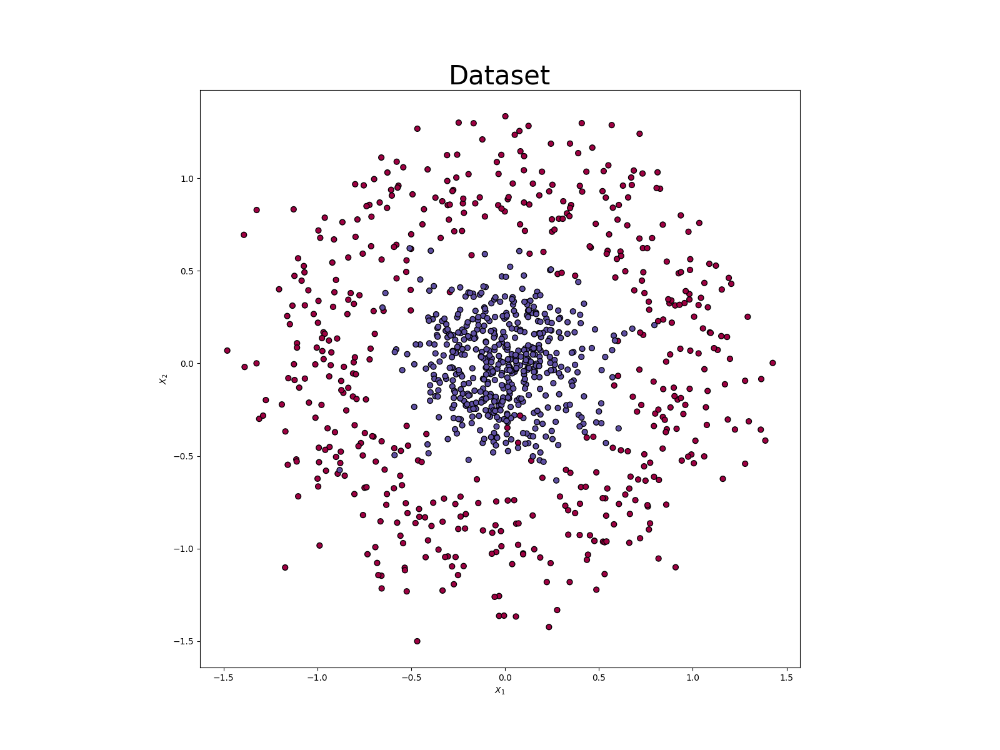

## Consignes pour l'examen

Bienvenue à la partie pratique de l'examen pour le cours <b>"Machine learning pour l'énergétique"</b>. Nous vous
invitons à lire très attentivement (et en entier) le readme ci-présent avant de commencer votre exercice.

Pendant cette expérience, vous aborderez un problème de classification binaire en utilisant un dataset artificiel
disponible à travers l'appel de la fonction
[```datasets.make_circles```](https://scikit-learn.org/stable/modules/generated/sklearn.datasets.make_circles.html)
de la libraire [```sklearn```](https://scikit-learn.org/stable/). Chaque point du dataset est caractérisé par 2 features
**X1** et **X2** et les outputs se répartissent en deux classes, les points bleus et les points rouges sur l'image ci-dessous.



Vous construirez un modèle de machine learning capable de classifier les données (à la fois de l'ensemble de test et de
l'ensemble d'apprentissage) dans le 2 classes avec une précision (*accuracy*) attendue de ~96%.
Comme vous l'avez vu pendant le cours théorique, la régression logistique sera votre meilleure amie.
Vous devez trouver les poids optimaux du modèle avec la technique de la *back propagation*. Vous résoudrez ce
problème dans les exercies **1** et **2** plus bas.

<ins>Une première question pour vous:</ins> Comment modéliser un problème de régression logistique sous la
forme d'un réseaux de neurones ? Sous quel nom cette architecture est connue  dans la littérature ?

**votre réponse:**

Pour obtenir la précision désirée, vous augmenterez le dataset en ajoutant des features dérivées
(étape de feature engineering) :


Par conséquence, la taille de vos inputs sera 4 unités.

- <b>Exercice 1.</b> Nous vous demandons de parcourir le fichier ```main.py``` dans le dossier "perceptron". Vous devrez:

  - définir la variable ```NN_ARCHITECTURE``` (ligne 61) selon les indications données ci-dessus

  - répondre aux questions présentes dans les différentes *docstrings* (recherchez le mot **EXERCISE** pour les trouver)

  - exécuter le code pour vérifier qu'il tourne, d'abord avec numpy puis avec Tensorflow

- <b>Exercice 2.</b> Dans le module ```functions_numpy.py```, nous vous invitons à remplacer la fonction 
*loss BCE (binary cross-entropy)* par la *loss MSE (mean squared error)*. En particulier vous devrez ajouter les parties
manquantes du code qui vous sont demandées à la ligne 105 et à mettre à jour les lignes 155 et 205. Nous vous invitons aussi à
implémenter cette modification à la ligne 11 du module  ```functions_tf.py```.
Vérifiez la performance de votre code: est-ce que ce changement a eu un impact positif ou négatif sur 
l'apprentissage ? Dans un exemple plus complexe, quel impact ce changement devrait-il avoir selon vous ?

  **votre réponse:**